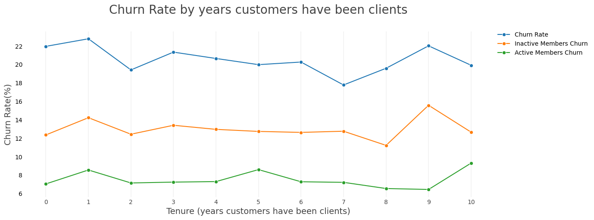
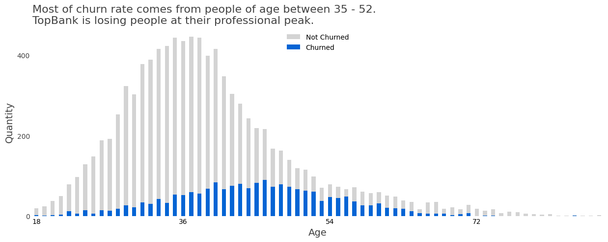
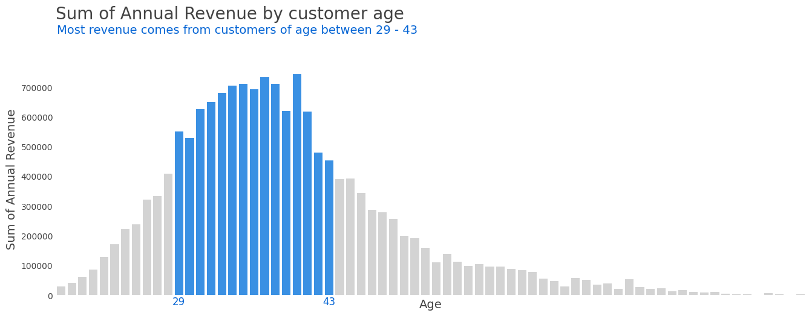
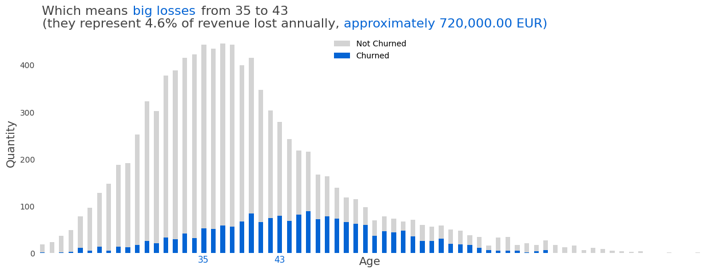
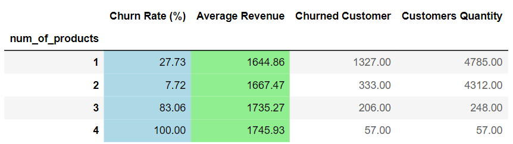
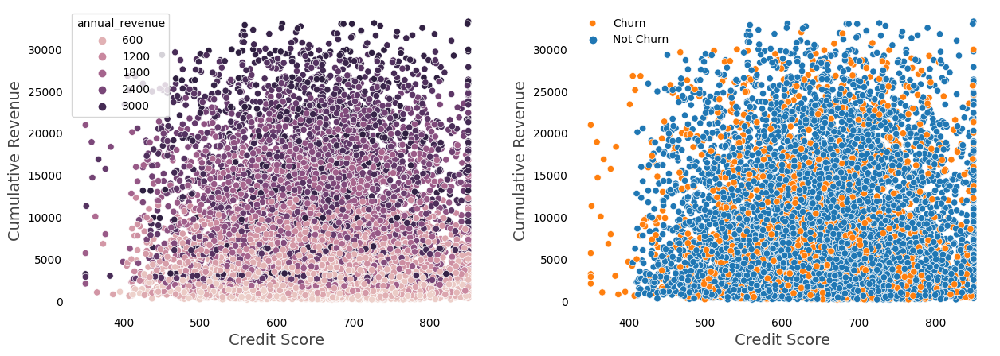

## Reducing the rate of customer turnover (CHURN).   
   
        1 - Context of the Problem.
        2 - Results.
        3 - Insights and some Highlights.
        4 - Improvements. What could I do differently?
            Resources

[DataSet.](https://www.kaggle.com/mervetorkan/churndataset)  
[Analysis](https://nbviewer.jupyter.org/github/pauloreis-ds/Projetos/blob/master/classification-churn/notebooks/topBank.ipynb) 
[ML Modeling](https://nbviewer.jupyter.org/github/pauloreis-ds/Projetos/blob/master/classification-churn/notebooks/topBankModel.ipynb) 
[PySpark Version](https://nbviewer.jupyter.org/github/pauloreis-ds/Projetos/blob/master/classification-churn/notebooks/1.0-pr-topbank-churn-pyspark.ipynb) 

## 1. Context of the Problem.

**TopBank Company**

- A Bank Services Company, with main operations on Europe.

- Offers financial products such as bank account, investments and insurance.

- Business Model: banking services through physical agencies and online.

- Main Product: bank account without costs, valid for 12 months. After this period, the account must be renovated.

- **Bank account revenue per client**:
   - 15% of client's estimated monthly salary, for clients with estimated income lower than the average;
   - 20% of client's estimated monthly salary, for clients with estimated income greater than the average.

**Problem**

- Clients' cancellation rate increased significantly in the last few months.

#### The challenge
As a Data Science Consultant, you need to create an action plan to decrease the number of churn customers and show the financial return on your solution.

**At the end of your consultancy, you need to deliver to the TopBank CEO a model in production, which will receive a customer base via API and return that same base scored, that is, one more column with the probability of each customer entering into churn.**

In addition, you will need to provide a report reporting the performance of your model and the financial impact of your solution. Questions that the CEO and the Analytics team would like to see in their report:

    What is TopBank's current Churn rate? How does it vary monthly?
    What is the model's performance in classifying customers as churns?
    What is the expected return, in terms of revenue, if the company uses your model to avoid churn from customers?

---   

## 2. Results

Observation: There are many ways to calculate the churn rate. One of them is: 

    Quantity of customers lost in a period divided by the quantity of customers in the beginning of that period.

 
 

- **What is TopBank's current Churn rate? How does it vary monthly?**

        Churn Rate:                 20.51%
           Active Members Churn:    07.51%
           Inactive Members Churn:  12.99%

          
> Since there are no dates or a clear linear timeline to follow  
> We can't tell how the churn rate varies monthly. We can look at  
> churn rates based on years customers have been clients of  
> TopBank, but we don't know the actual year for the customer  
> who stayed 1 year, for example (was he a client in 2020? 2019?  
> 2018?). Thus, we don't have a real a timeline.

  

 

- **What is the model's performance in classifying customers as churns?**

        The model will detect 88% of customers who will actually churn.
        And 92% of customers identified as churn will be actual churn cases.  

- **What is the expected return, in terms of revenue, if the company uses your model to avoid churn from customers?**

> Churn rate being around 20% and customers quantity of 10,000, meaning 2,000 may churn...  
> and an expected annual revenue per customer as 1,658.00 EUR.
            
            In the best case scenario:
            
                If TopBank, knowing that a customer is going to leave the company, 
                can prevent that from happening...

                It's expected for the bank to (re)gain 2,918,474.51 EUR with those customers.
                
> **In the worst case scenario this value would be about 24,495.35 EUR**  
> You can check the mindset for the calculation at the end of [topBankModel notebook](https://nbviewer.jupyter.org/github/pauloreis-ds/Projetos/blob/master/classification-churn/notebooks/topBankModel.ipynb)

**_You can check out the [Web App](https://share.streamlit.io/pauloreis-ds/topbankstreamlit/main/app.py) and see the model in action._**

---   

## 3. Insights and some Highlights.

### **_Churned customers._**

    

    

    

- **_Maybe TopBank should create new products/services... or adapt the existing ones to better fit those._**

 
 

### _Customers who are active members have lower churn rate._

> **Yes!** 7% against 13% 
> **55% of revenue comes from active members. However,  
> 14% of them may churn. Which means 7.7% of annual revenue  
> is being lost** (approximately 1,200,000.00 EUR).
>
> **45% of revenue comes from inactive members and 27%  
> of them may churn. Therefore, 12% of annual revenue is  
> being lost** (approximately 1,900,000.00 EUR).

- **_Thereby, creating an action plan focus on turning the customers into active members seems great.  
 Of course, It would depend on its cost when compared to the cost and gains from other planings._**

 
 

### Customers who buy more products have lower churn rate.

> **No**, and the more the products the more the mean revenue. 
> Customers who should have greater value are leaving.

    

 
 

### Customers with credit card have a lower churn rate.
                
> No, **the rates within the groups are quite equals (20%), besides, 
> as there are more customers with credit card (70%), that is a bad sign  
> because it means TopBank is losing many potential good customers,  
> with greater engagement.**

### Higher credit score means more revenue.

    If that so, we would see the color getting darker from left to right.
    

  

 

     

## Some assumptions done while exploring...

_Some we can't tell if they're true, but if we could, those would help us to understand better what's happening and how it affects the phenomenon._
    
    1.2.2. Categorical Attributes
        
    So far, boxplots are pretty similar and the one which gets my attention is the "balance" one.
    Even though the salaries among the countries are quite similar, people in Germany, in general,
    has a greater balance account. Does it mean a better financial education? Anyways, it might 
    also mean that by losing a customer from Germany there's a high chance of losing a good customer.

    5.1.2. Numerical Variables

        Credit Score

    The credit score distribution kind of tends to high values (the boxplot in 1.2.2.Categorical Attributes
    shows that too, but to really validate this We should talk to an expert from TopBank, then We could know
    exactly which value the company considers high). 

    50% of customers have a score above the mean, so when a customer leaves TopBank there's a good chance the
    company is losing a high quality customer.
  
  
        Tenure

    "Tenures" are similar. If people are leaving at different times, it might be they're facing problems on 
    different services (we could also try to categorize by different types of customers... anyway, it's a
    whole new analysis), thus the enterprise would have to improve in more than just "some services"... As you
    can see, the histogram shows fewer people that churn in less than 1 year (0) and after 10 years (which doesn't
    make sense?), this probably happens because of the season the data started to be collected (mid-year, perhaps?)
    and when it was finally sent to analysis. Again, expertise domain from the company would really help (as well
    as more data representing other information, such as dates, products and so on).
    
    
        Balance

    Similar assumption to Credit Score's. Losing a customer with high balance might be a situation we want to
    avoid. It's weird the fact that there're many accounts with 0 as balance.
    Number of Products

    Most of the customers consume 1 or 2 products. It would be good to ask the company which products are these
    to try to understand why this happens. Do people buy 1, 2 and then stop buying? Is it an aftersales problem?
    Or is is a normal phenomenon?
      
      
        Credit Card

    Most customers have credit card (70%). This can be good or bad, depending on how much the company wishes to gain
    from it (besides the "maximum gain" ideal) and depending on which metric they would use to measure that gain.
    But in general, it seems good.

    If customers with credit card bring higher revenue, there's also a high chance TopBank is losing good customers
    when they leave.
    Active Members

    We have an almost equal number of active and non-active members, not a very good sign if non-active members are
    the ones who leave the company in higher rates. We might want to investigate that later trying to understand why.
       
       
        Salary (annual_revenue, revenue_per_product, total_revenue)

    There is some quantity of salary with very low values... outliers, which affects features as
    annual_revenue, revenue_per_product and total_revenue. Those are basically telling us that most of 
    company's revenue comes from lower prices products (this might be a misinterpretation, though. Since
    we don't really know the actual prices for each product).
    
    
        Geography

    France has twice as many customers as Germany. But Germany has twice the churn rate. This is kind of scary,
    but it may mean that TopBank should apply a different marketing plan there or those customers should receive 
    other services. As usual, communication with people with domain knowledge could guide our decisions here 
    (in case we decide to investigate this event deeper).
        
            
---

## 4. Improvements. What could I do differently?
    
**1 - Germany - France - Spain**

Analyzing more in depth the "geography" category. A deeper study about what the data tell us about what's happening in each country could give us very useful information. TopBank's next steps could be towards that direction.
    
**2 - More Types of Data.**

Some assumptions requires different types of data to be available, as information about the products or dates showing when the customer arrived or left. In case, TopBank didn't have some, it would be a great advise telling them to start collecting them. Then, in the future this data would be well used.

**3 - Customer Clusters**

A cluster analysis in favor of clients understanding may also be a later project to be implemented here. Identifying structures within the customer data could lead us to better understanding of who and why is leaving. There might not be enough data for this, though. I'm not really sure.

**4 - Inactive Members**

Since inactive members are prone to leave TopBank, an analysis focused on predicting which member is going to be inactive and how to change that situation can bring considerable results to the bank.
    
---   

[Web App Code](https://github.com/pauloreis-ds/topBankStreamlit)

    Resources: Python 3.7. Pandas, Numpy, Matplotlib, Seaborn.
               Inflection, Scipy, Sklearn, Smote.
               Streamlit.
   
   

---
